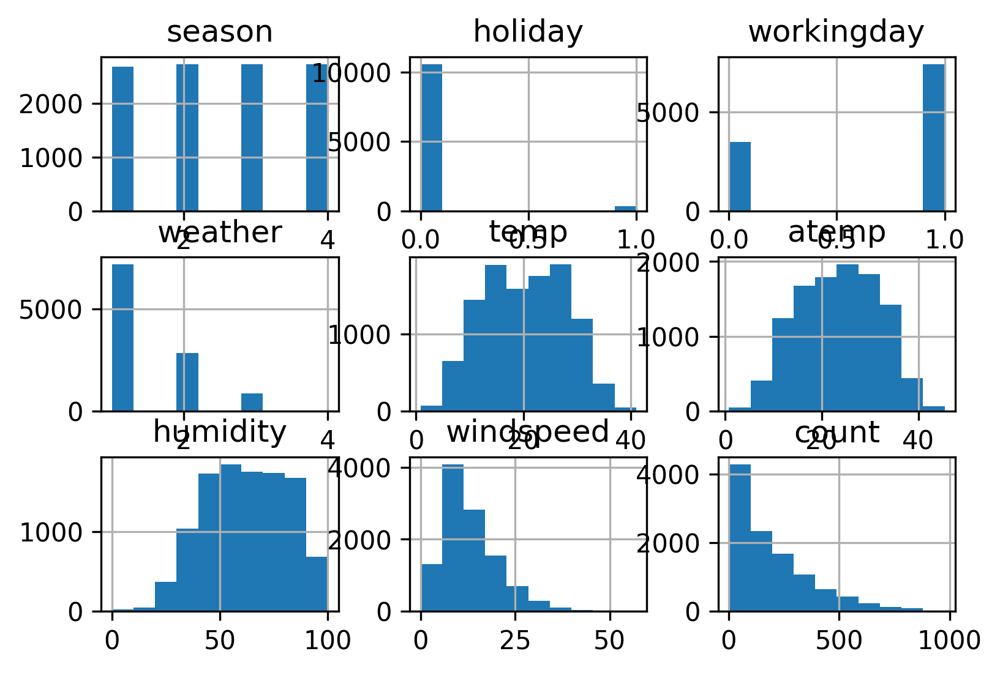
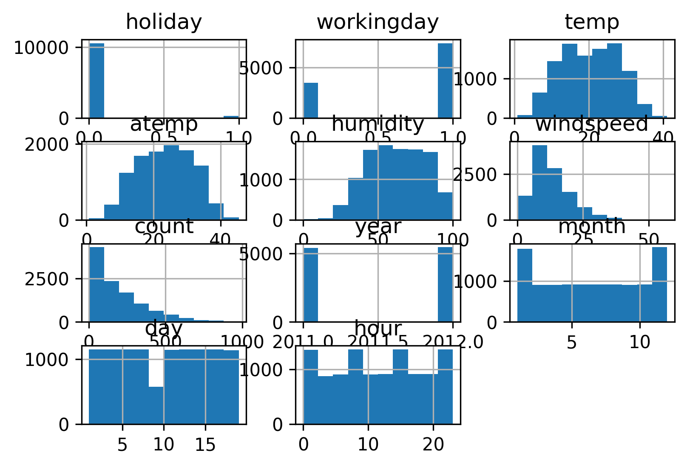
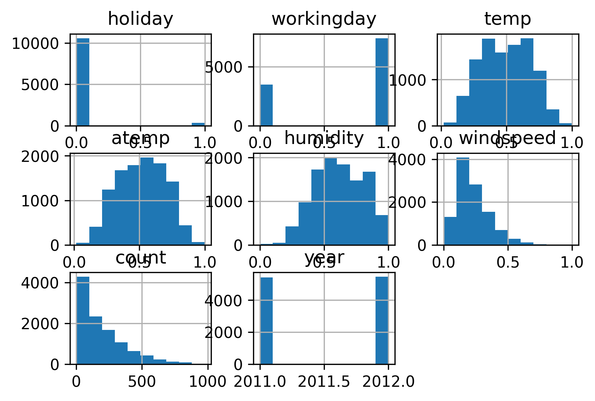
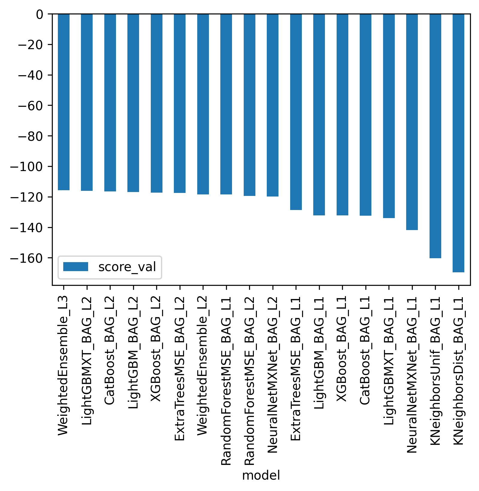
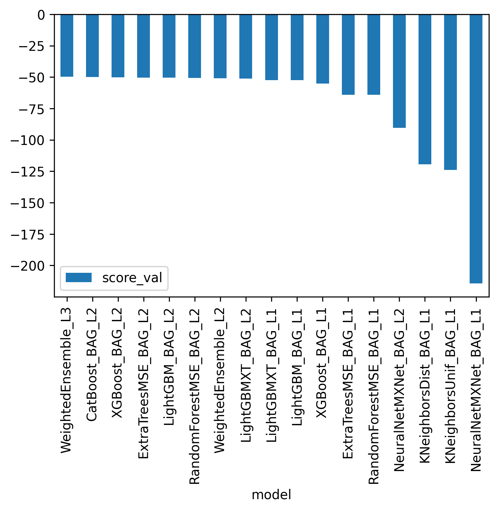
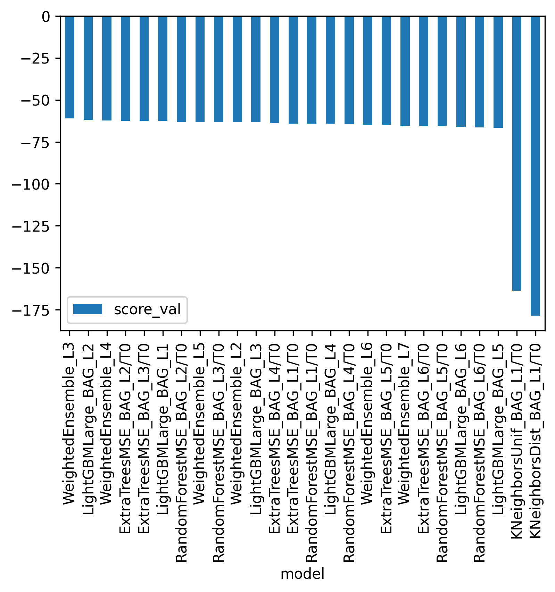
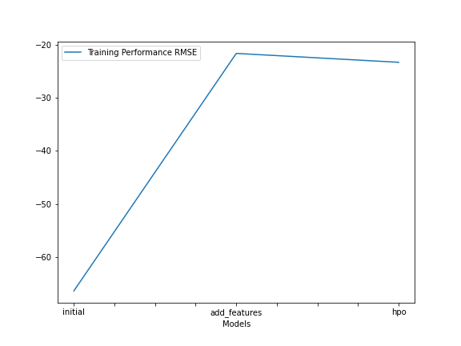
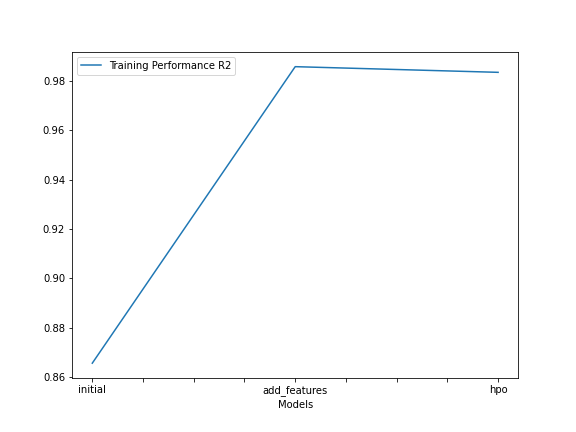
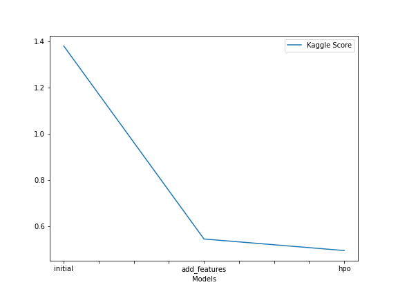

# Report: Predict Bike Sharing Demand with AutoGluon Solution
#### Ramin Anushiravani

## Initial Training
### What did you realize when you tried to submit your predictions? What changes were needed to the output of the predictor to submit your results?
I was able to submit the predictions as the predictions did not include any negative values. I did realize that the score of my first initial model is a lot more than what was listed on Kaggle and that helped me understand a simple autoML solution with no optimization does not provide an acceptable perforamnce.

### What was the top ranked model that performed?
Weighted ensembles with L2 regularization seemed to outperformed other models in every scenario.

## Exploratory data analysis and feature creation
### What did the exploratory analysis find and how did you add additional features?

Some features were very sparse, 0 or 1 and some very floats and some were categorical. I first normalized the features, those that needed to be categorical were casted and those that were floats were normalized to a range of 0-1. I used the same scalar on the test data. I dropped the feature year, as it did not add any useful information to he model prediction.
I've also noticed that Holidays has a much higher count than weekdays, this features though probably relevant, can skew the model's prediction.

### How much better did your model preform after adding additional features and why do you think that is?
The rmse went down from 1.38 to 0.54 after splitting the datetime to year, month, day, and hour and converting the columns to categorical types.

## Hyper parameter tuning
### How much better did your model preform after trying different hyper parameters?
In addition to trying more hyperparameters, I also normalized temp, atemp, and humidity to be in a range of 0-1. The RMSE of the model on the validation set didn't change, but the kaggle score improved from 0.54 to 0.49.

### If you were given more time with this dataset, where do you think you would spend more time?
I'd probably start by collecting data and figuring out which features are more important to keep and which one's are not useful. We could also span the number of hyperparameters and the training time.
I'd then start with a basic model and try to adjust the hyperparameters on that model. I set search_strategy to auto and increased the number of hyperparameters configs to 10.

### Create a table with the models you ran, the hyperparameters modified, and the kaggle score.
|model|hpo1|hpo2|hpo3|score|
|--|--|--|--|--|
|initial|Weighted Ensemble -115.75|Light GBMXT -116.19|CatBoost -116.5|1.38|
|add_features|Weighted Ensemble -49.5|CatBoost -116.5|XGBoost -50.2|0.54|
|hpo|Weighted Ensemble -61.12|Light GBMLarge -61.7|Weighted Ensemble -62.4|0.496|

### Create a line plot showing the top model score for the three (or more) training runs during the project.

Model Scores on different hyperparameters

Model Metric Performance

### Create a line plot showing the top kaggle score for the three (or more) prediction submissions during the project.

## Summary

As you can see the Kaggle scores has been improved from 1.38 to 0.49 through feature engineering and hyperparameters tuning.It's interesting to note that although the model with more varied hyperparameters and new features has a higher rmse than that with only added features, it still does better on kaggle score. I think that's a sign that the second model was slightly overfitting to the training dataset and the third model did a better job at generalizing. 
